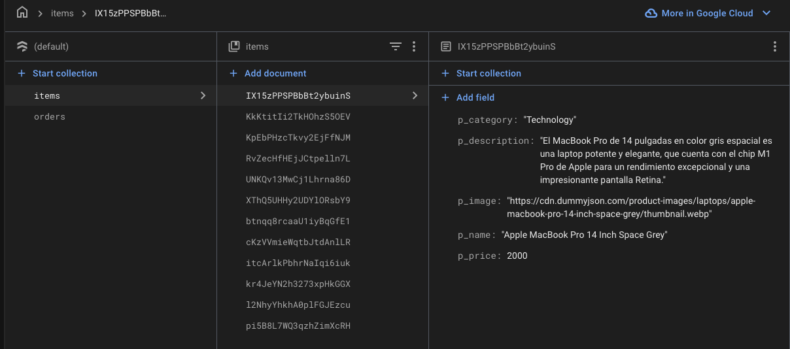

# Aplicación eCommerce React

## Características

- **Gestión del Carrito**:
  - Agregar productos al carrito con cantidad.
  - Eliminar productos individuales del carrito.
  - Vaciar el carrito por completo.
  - Mostrar el total de productos y el precio total en el carrito.

  **Nota**: La funcionalidad de limitar la cantidad por producto no se implementó, ya que implicaba cambios en la base de datos y estaba alineada a cambios bajo sesión.

- **Navegación Dinámica**:
  - Navegación SPA utilizando React Router.
  - Rutas dinámicas para categorías de productos y detalles de productos.
  - Manejo de errores para rutas inválidas con retroalimentación al usuario.

- **Integración con Firebase**:
  - Obtener datos de productos desde Firestore.
  - Filtrar productos por categoría y mostrar detalles de productos.
  - Guardar órdenes de compra en Firestore con generación de ID único.

- **Diseño Responsivo**:
  - Estilizado utilizando Material-UI para un diseño consistente y responsivo.

## Instalación

1. Clonar el repositorio:
   ```bash
   git clone https://github.com/your-repo/eCommerceReact.git
   ```
2. Instalar dependencias:
   ```bash
   npm install
   ```
3. Iniciar el servidor de desarrollo:
   ```bash
   npm run dev
   ```

## Linting

El proyecto utiliza ESLint con reglas específicas para React para garantizar la calidad del código. Ejecuta el comando de linting:
```bash
npm run lint
```

## FireBase


